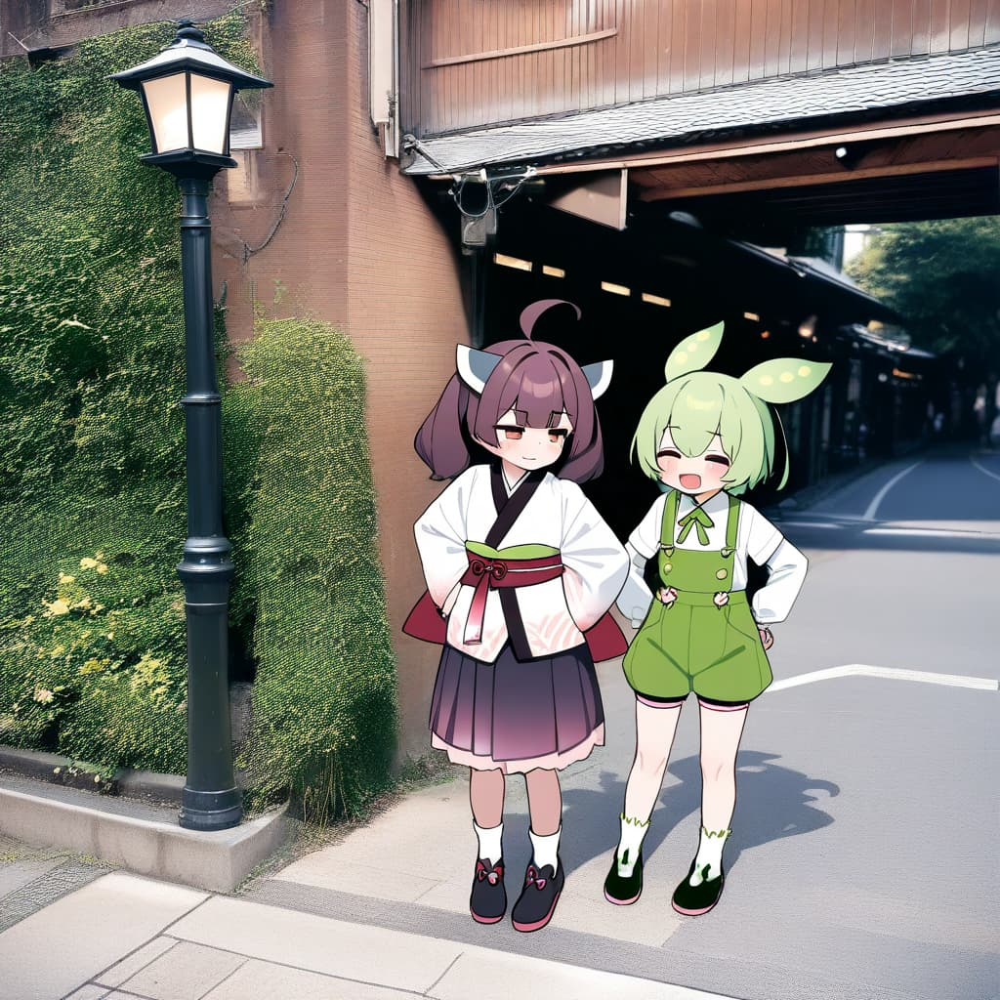

# danbot-comfy-node 

Danbooru Tags Translator for ComfyUI. 
This custom node allows you to convert natural language prompts in Japanese and English into Danbooru tags.

## Installation

### Manual Installation

```bash
# activate your env
cd custom_nodes
git clone https://github.com/p1atdev/danbot-comfy-node
cd danbot-comfy-node
pip install sentencepiece protobuf
# or if you are using uv, you can:
# uv pip install -r ./pyproject.toml
```

### ComfyUI Registry

```
comfy node registry-install danbot-comfy-node
```

## Example Workflows

See [workflows directory](./workflows).

| Filename | Description |
| - | - |
| [Translation+Extension.json](./workflows/Translation+Extension.json) | Example workflow of translating and extending Danbooru tags from a Japanese prompt.   |
| [Translation+Extension+Image_Generation.json](./workflows/Translation+Extension+Image_Generation.json) | Example workflow of translating and extending Danbooru tags from a Japanese prompt, and then generating an image using AnimagineXL 4.0. |

## Example Outputs

| Input prompt | Translated tags | Extended tags | Generated image |
| - | - | - | - |
| `猫耳で黒髪ロング、制服を着ており、目は黄色の少女。背景はハーフトーンのついた青で、白枠が付いている。ソファーに座って足を組みながらこっちを見ている。` | `1girl, solo, blue background, halftone background, looking at viewer, animal ears, school uniform, yellow eyes, black hair, long hair, sitting, crossed legs, cat ears, border, halftone, white border, couch` | `shirt, skirt, closed mouth, very long hair, short sleeves, white shirt, full body, black skirt, pleated skirt, black footwear, collared shirt, socks, black socks, outside border` |  |
| `ピクセルアート。猫耳の女の子がダンボール箱に入っている。chibi。青と白の二色の髪色。パーカーを着ている。` | `1girl, multicolored hair, blue hair, white hair, two-tone hair, chibi, cat girl, hoodie, hood, box, pixel art, in container, in box` | `solo, long sleeves, animal ears, very long hair, sleeves past wrists, sleeves past fingers, blue eyes, long hair, full body, cat ears, chibi only, tail, cat tail, cardboard box` |  |
| `VOICEVOXのずんだもんと東北きりたんが東京の街中で立っている。写真の背景。全身が写ってる。笑顔。` | `voiceroid, voicevox, touhoku kiritan, zundamon, 2girls, multiple girls, photo background, smile, standing, full body, road, street` | `photo background, photo-referenced, open mouth, shirt, long sleeves, closed mouth, orange eyes, brown hair, green hair, ahoge, short sleeves, medium hair, white shirt, hands on own hips, looking at another, black footwear, half-closed eyes, closed eyes, t-shirt, layered sleeves, short over long sleeves, japanese clothes, kimono, sash, socks, white socks, green shorts, shorts, white kimono, headgear, obi, lamppost, green overalls` |  |

<details>
<summary>Generation settings</summary>

- Prompt generation
  - Translation
    - rating: `general`
    - length: `very_short`
    - template_name: `translation`
  - Extension
    - rating: `general`
    - length: `long`
    - template_name: `extension`
  - Generation config
    - max_new_tokens: `256`
    - do_sample: `true`
    - temperature: `1.00`
    - top_p: `1.0`
    - top_k: `50`
    - min_p: `0.05`
    - num_beams: `1`
  - Seed: 347414205
- Image generation
  - Image model: [AnimagineXL 4.0 opt](https://huggingface.co/cagliostrolab/animagine-xl-4.0/blob/main/animagine-xl-4.0-opt.safetensors)
  - Prompt suffix (quality tags): `masterpiece, best quality, high score, great score, latest`
  - Negative prompt: `lowres, bad anatomy, bad hands, text, error, missing finger, extra digits, fewer digits, cropped, worst quality, low quality, low score, bad score, average score, signature, watermark, username, blurry, `
  - Image size: 1024x1024
  - Seed: `944162813372176`
  - Steps: `25`
  - CFG: `5.0`
  - Sampler name: `euler_ancestral`
  - Scheduler: `normal`
  - Denoise: `1.00`

</details>

## Available models

| Model name | Knowledge cutoff | Param size |
| - | - | - |
| [🤗 DanbotNL 2408 260M](https://huggingface.co/dartags/DanbotNL-2408-260M)| 2024/8/31 | 262M |
